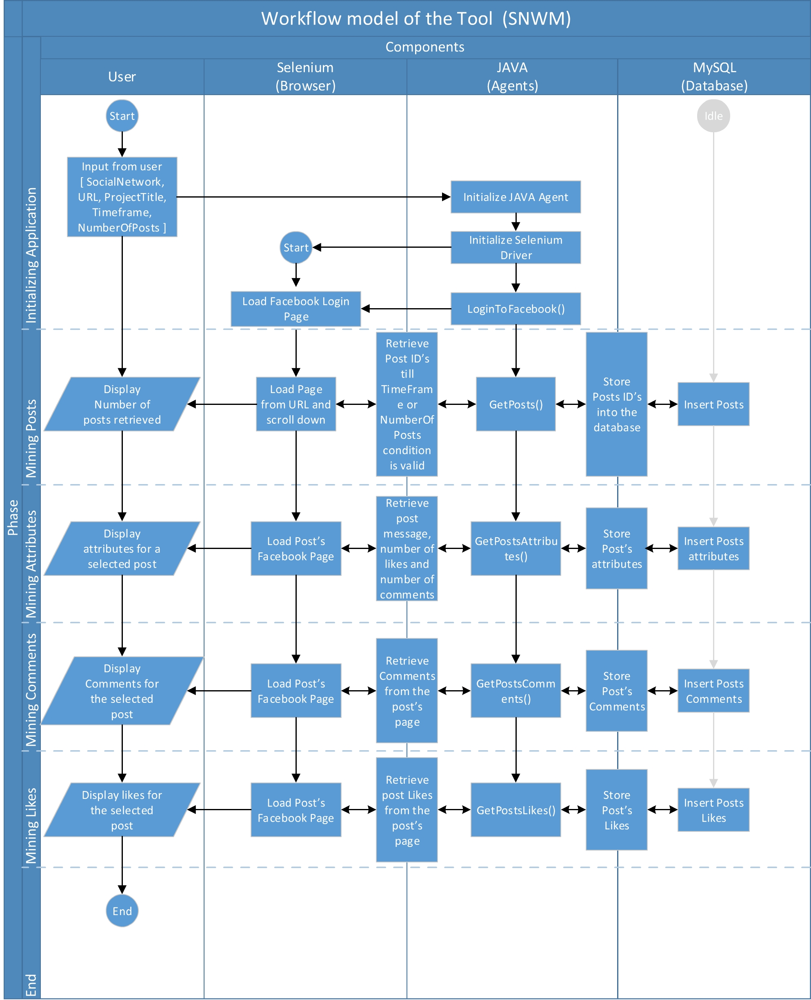

  
  
  

  

  <h2 align="center">Social Network Web Mining (SNWM) Tool workflow model</h2>
 

## Introduction

This section presents the workflow model of the SNWM tool. SNWM workflow model is partitioned with respect to components and phases. The workflow is divided into four components and six phases. This workflow model is inspired by the model presented by Matthias Schur [1].

## Components 

There are four components of the workflow model. 

###### User

The first component is the user, this component represents the identity that initiates the process of mining data from the social network. Currently it is represented by a user, however, this tool can also be integrated into an existing application framework, where the initiation is done by computer code, rather than a human being. Initiation is done by executing a Java application with additional attributes. These attributes are Social network, URL, Project Title, Timeframe, and the number of posts. Social network attribute can have one out of three options, i.e., Facebook, LinkedIn or Twitter. URL represents the link to the public page (Facebook or LinkedIn) or public handle (Twitter). Project Title is used to create a directory on the computer to store all mined data. Timeframe and number of posts set the scope of the posts. Only those posts will be collected from the social network which resides inside the specified timeframe or is less than the specified number of posts. 

###### Selenium

The second component is the selenium. The simplest way to understand this component is to imagine a browser that can be controlled using programmable commands. Selenium usage is divided into three parts, Selenium web driver, a Browser and Jave libraries. Selenium web driver is a standalone software that acts as a server. Selenium web driver is configured to launch a Browser (second part) and control all interactions performed on the browser. Selenium web driver is initiated using java code via Selenium libraries. Once selenium libraries are initiated, java code is written to send commands to the driver, which in response perform actions on the browser and return the state of the web to the java application. 

###### Java agents

The third component is the Java agents. Java agents is a Java program which mimics human behavior on the social network website, hence, it is called an agent [2]. This component is further divided into human similar actions such as LoginToFacebook(), GetPosts(), GetPostsAttributes(), GetPostsComments() and GetPostsLikes(). Each action is represented by a function that performs respective tasks on the browser connected via selenium web driver.

###### MySQL Database

The fourth component of the model is the MySQL database. This component is responsible for storing information extracted from the mined data. Selenium and Java agents work with HTML code retrieved from the social network websites, whereas, for each HTML code, java agent extracts the valuable information such as Post's ID, Post's Message, Post's Likes count, Post's Comments count. Also for each post user who provided the likes and comments are also extracted. A user is identified by the unique link at the Facebook website. This link is available at any place a user provides a comment or like. All of this information is stored inside the Database for research purposes.

## Phases

There are six phases of the workflow model. 

###### Initializing application

The first phase of the workflow model is the initialization phase.  This phase involves three component, whereas, fourth component "MySQL Database" is pre-requisite of this phase. MySQL database can be installed by using free software known as XAMP Server. MySQL database should be installed and running before starting this phase. This phase starts by information generated and passed by the user to the Java agent program. Based on the provided information, the Java agent launchs the browser and opens the selected social network website. Once the social network website is opened, java agents logs into the application. Login credentials are to be provided by the user. After loging in to the website, selenium agent utilize the same session for all the proceeding phases. 

###### Mining posts

The second phase is about mining the posts available on the social network website. Posts are generated by the organization maintaining the social network public page/handle. For all of the social network websites, once public page/handle is loaded, selenium keep scrolling down until the desired time frame or posts limit is reached. After collecting the posts, Java application stored the identified posts into MySQL database. The user can also observe the statistics related to the posts from the MySQL admin panel.

###### Mining attributes

The third phase first collects all of the posts from the database and for each post, loads post's page. Post's page is a unique URL that only presents the content related to a specific post. Content contains post message, number of likes, number of comments, is edited or not etc., as valuable information. This information is extracted and stored inside the database for each identified post. Database statistics can be viewed from the MySQL admin panel.

###### Mining comments

The fourth phase is responsible for collecting the comments related to the collected posts. First, a complete list of posts is retrieved from the database. Then, for each post, comments are mined from the social network website. Comments are represented as messages posted by unique user ID. Both message and the user ID are stored insite the MySQL database. MySQL admin panel can be used by the user for viewing gathered comments.

###### Mining likes

The fifth phase is responsible for collecting likes related to the collected posts. First, a complete list of posts is retrieved from the database. Then, for each post, likes are mined from the social network website. Likes are represented by the unique user's ID who clicked on the like button of the post. Finally, collected likes ( user IDs ) are stored inside the MySQL database. MySQL admin panel can be used by the user for viewing gathered likes.

###### End

In the end, cross-validation is performed by checking if attributes, comments, and likes have been retrieved for each post. If for any post, any of the phases is not executed, it is repeated before ending the application. 

## References

[1] Schur, Matthias, Andreas Roth, and Andreas Zeller. "Mining workflow models from web applications." IEEE Transactions on Software Engineering 41, no. 12 (2015): 1184-1201.

[2] Nwana, Hyacinth S. "Software agents: An overview." The knowledge engineering review 11, no. 3 (1996): 205-244.

## Disclaimer
> This tool is developed using open source technologies such as Java, MySQL, and Selenium. Author / GitUser developed this tool for mining public data from the social network websites (e.g. Facebook). Data available on the social network websites is their property and should be used with their permission, however, this tool only mines data that is searchable by Google (anyone can view the public data available on the social networks). This tool is developed for research purposes only and should not be used for financial purposes or to do ill to others. 
